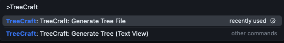

# TreeCraft – Project Structure Visualizer

Generate beautiful, readable visual representations of your project's folder structure directly inside VS Code. TreeCraft traverses your workspace, respects `.gitignore`, and outputs a tree view with intuitive file/folder icons. You can view the tree in a new editor tab or export it to a `folder-tree.txt` file at the workspace root.



## Features

- **Text View generation**: Render the project tree in a new untitled document.
- **Export to file**: Save the generated tree to `folder-tree.txt` at your workspace root.
- **Emoji icons**: 📁 for folders and 📄 for files for quick scanning.
- **Respects ignores**: Skips common directories and patterns (e.g., `.git`, `node_modules`, `.vscode`, `.DS_Store`, and patterns from your `.gitignore`).

## Requirements

- **VS Code**: ^1.74.0
- **Node.js**: 16.x (matches the dev dependency types)

## Installation

### From source (recommended for now)

1. Clone this repository.
2. Install dependencies:
   ```bash
   npm install
   ```
3. Build the extension (optional; VS Code can compile on debug):
   ```bash
   npm run compile
   ```
4. Press `F5` in VS Code to launch an Extension Development Host with TreeCraft loaded.

### From a VSIX (optional)

- If you have a packaged `.vsix`, open the Extensions view → ⋯ menu → Install from VSIX... and select the file.

## Usage

You can run TreeCraft from the Command Palette or the Explorer context menu.

- **Command Palette**: `Cmd+Shift+P` → search for:

  - `TreeCraft: Generate Tree (Text View)` (`folderTreeGenerator.generateTree`)
  - `TreeCraft: Generate Tree File` (`folderTreeGenerator.generateTreeToFile`)

- **Explorer context menu**: Right‑click in the Explorer and choose:
  - `TreeCraft: Generate Tree (Text View)`
  - `TreeCraft: Generate Tree File`


## Example output

Text View and exported file produce the same formatted tree. Example:

```text
└── 📁 my-project
    ├── 📁 src
    │   ├── 📄 index.ts
    │   └── 📄 utils.ts
    ├── 📁 test
    │   └── 📄 app.test.ts
    ├── 📄 package.json
    └── 📄 tsconfig.json
```

The exported file will be created at your workspace root as `folder-tree.txt`, and VS Code will open it automatically after generation.

## Troubleshooting

- If you see “No workspace folder open”, open a folder or workspace first.
- Very large folders may take longer to render; TreeCraft limits traversal depth by default to keep it snappy.

## Commands reference

- `folderTreeGenerator.generateTree` – TreeCraft: Generate Tree (Text View)
- `folderTreeGenerator.generateTreeToFile` – TreeCraft: Generate Tree File
- `folderTreeGenerator.test` – TreeCraft: Test Extension

---

Made with ❤️ by Abdullah Mia.
